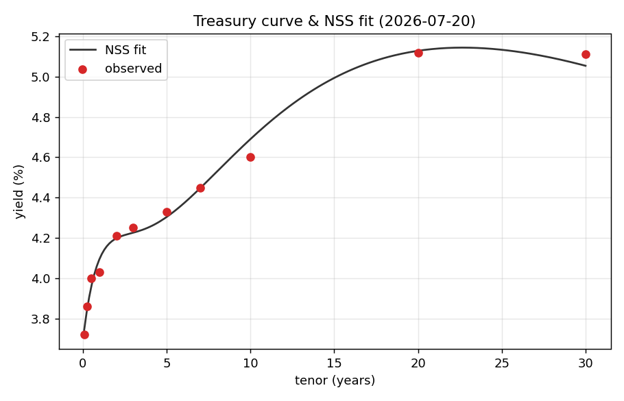
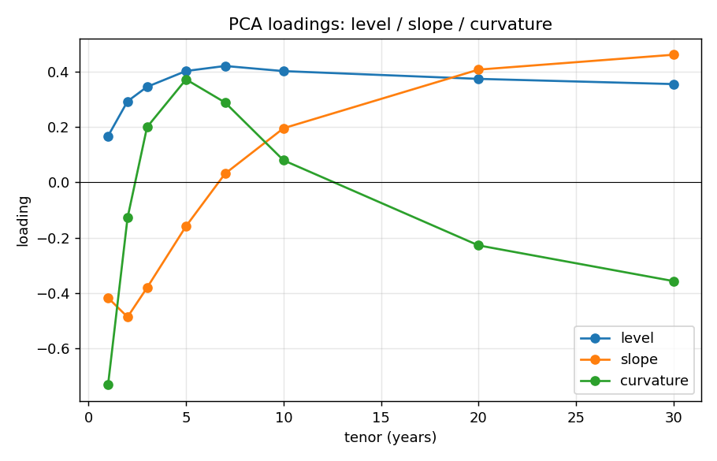
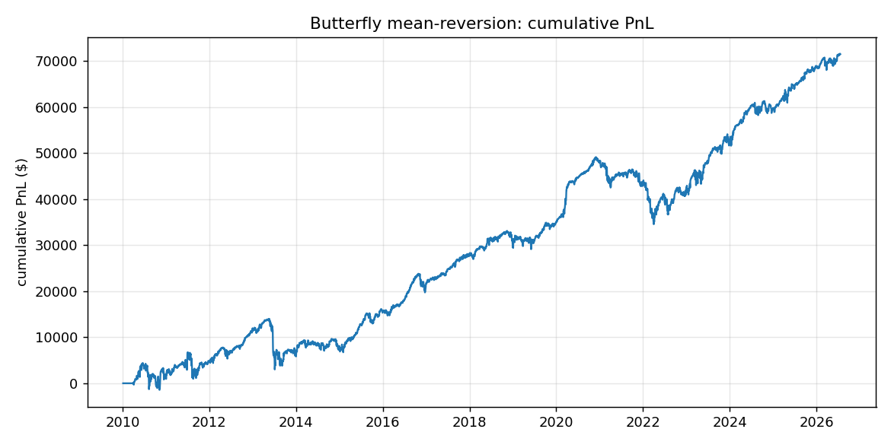

# yield-curve-rv

**A U.S. Treasury yield-curve relative-value research toolkit.**
Fit the curve, decompose it into level / slope / curvature factors, and backtest
DV01-neutral butterfly trades driven by mean-reversion, carry, and roll-down.

[](https://github.com/evanwu888/yield-curve-rv/actions/workflows/tests.yml)
[](https://www.python.org/)
[](LICENSE)

The whole pipeline runs on real Treasury data with a single command:

```bash
pip install -r requirements.txt
python scripts/run_research.py --charts
```

No API key needed. A real 2010–present daily curve history is bundled, and
`--live` pulls fresh data straight from the St. Louis Fed (FRED).

---

## Overview

The yield curve is driven by a few common factors, and most relative-value
trades are constructed to be neutral to the factors the trader has no view on.
This repository implements that workflow end to end: data → curve fitting → PCA
factor decomposition → signal construction → DV01-neutral trade sizing →
backtest → transaction-cost analysis. The core library depends only on NumPy
and pandas.

**Scope.** This is a research and backtesting toolkit, not a live trading
system. It runs on historical data and can also pull the latest published curve
(`--live`) to compute current rich/cheap and carry/roll figures, but it does not
stream data, place orders, or run continuously.

## What's inside

| Module | What it does |
| --- | --- |
| `ycrv/data.py` | Load bundled Treasury history; `fetch_fred()` for live data (no key). |
| `ycrv/curve.py` | **Nelson-Siegel-Svensson** curve fit (linear-in-betas + λ grid search) and a repricing-based **par-bond DV01**. |
| `ycrv/pca.py` | **PCA** of daily yield changes → level / slope / curvature factors. |
| `ycrv/signals.py` | Slopes, **butterfly** spreads, rolling **z-scores**, and **carry + roll-down**. |
| `ycrv/strategy.py` | DV01-neutral **butterfly mean-reversion** book. |
| `ycrv/backtest.py` | DV01-space backtester with transaction costs and no look-ahead. |
| `ycrv/metrics.py` | Sharpe, Sortino, max drawdown, Calmar, hit rate, skew. |

## The finance, briefly

**1. Curve construction (Nelson-Siegel-Svensson).** The curve is fit with the
6-parameter NSS model. The trick used here: for *fixed* decay constants
(λ₁, λ₂) the model is **linear in the four betas**, so betas are solved by OLS
and only the two λ's are grid-searched — fast, deterministic, and dependency
free. The residual of each tenor versus the smooth fit is the raw **rich/cheap**
signal (a bond yielding *above* the fitted curve is cheap).

<p align="center"></p>

**2. Factor decomposition (PCA).** Run on daily yield *changes* of the coupon
curve, the first three principal components are textbook — and reproduced here
on real data:

```
Explained variance:  level 84.4%   slope 11.4%   curvature 2.3%   (98.0% total)
```

Level loads positively everywhere (parallel shifts), slope goes short-negative /
long-positive (steepeners), and curvature is the belly-vs-wings hump that
butterfly trades target.

<p align="center"></p>

**3. Carry & roll-down.** For each tenor the toolkit computes the expected P&L of
simply *holding* the bond if the curve doesn't move — coupon carry net of
funding, plus the price gain from rolling down an upward-sloping curve. This is
the "do nothing" return every RV trade is measured against.

**4. DV01-neutral butterflies.** A butterfly is long the belly and short the two
wings, sized so the three legs sum to **zero DV01**. That makes the book immune
to parallel level moves (PC1) and expresses a clean view on curvature. The
butterfly spread `S = 2·y_belly − y_short − y_long` is strongly mean-reverting,
so the strategy fades its rolling z-score:

> when the belly cheapens (`z` high), go long the fly and wait for it to snap back.

## Results

Backtest of a three-butterfly book (`6m-2y-5y`, `2y-5y-10y`, `5y-10y-30y`),
DV01-neutral, daily rebalance, 0.1bp half-spread, 2010–2026:

| Metric | Value |
| --- | --- |
| Sharpe | **0.81** |
| Sortino | 1.05 |
| Hit rate | 51.9% |
| Max drawdown | −$14.6k (on ~$300 gross DV01) |
| Calmar | 0.30 |

<p align="center"></p>

**Sensitivity to transaction costs.** The same book, swept over the assumed
bid/ask half-spread:

| half-spread (bp) | 0.00 | 0.05 | 0.10 | 0.15 | 0.20 | 0.30 |
| --- | --- | --- | --- | --- | --- | --- |
| Sharpe | 1.33 | 1.07 | 0.81 | 0.56 | 0.30 | −0.22 |

Gross Sharpe is ~1.3 and turns negative by a 0.3bp half-spread, so results
depend heavily on the assumed execution cost.

## Quick start

```bash
pip install -r requirements.txt

# full research report (console)
python scripts/run_research.py

# ...also save charts to docs/
python scripts/run_research.py --charts

# ...against freshly-fetched FRED data
python scripts/run_research.py --live

# refresh the bundled dataset
python -m ycrv.data

# tests
pytest -q
```

Using the library directly:

```python
from ycrv.data import load_sample
from ycrv.strategy import ButterflyRVStrategy, Fly

curve = load_sample()
strat = ButterflyRVStrategy(flies=[Fly(2, 5, 10), Fly(5, 10, 30)])
result = strat.run(curve, half_spread_bp=0.1)
print(result.summary())
```

## Design notes & assumptions

Being explicit about the modelling choices (and their limits):

- **Yields, not bond prices.** Trades are booked in DV01 space against
  constant-maturity par yields. This captures curve dynamics cleanly but
  abstracts away individual-CUSIP financing, specialness, and the on-the-run /
  off-the-run basis.
- **DV01 via repricing.** `par_bond_dv01` reprices a par coupon bond at ±1bp;
  the 10y at 4.6% returns 0.079, matching the modified-duration identity.
- **No look-ahead.** A position set at the close of day *t* earns the yield
  change into *t+1*; the first day (no prior position) is dropped, not counted
  as zero — enforced by `min_count=1` and covered by a test.
- **Costs are a linear bid/ask** on DV01 traded. Market impact and financing
  drift are not modelled, so live results would be *worse* than shown.
- **NSS β's are not interpreted individually.** They are only weakly identified
  (the classic λ₁≈λ₂ degeneracy), so PCA is used for factor interpretation and
  NSS only for the smooth fit and rich/cheap residuals.

## Data

U.S. Treasury constant-maturity par yields (1M–30Y), daily, from the Federal
Reserve H.15 release via [FRED](https://fred.stlouisfed.org/). The bundled
`data/ust_yields.csv` covers 2010-01-04 onward (4,138 daily curves × 11 tenors).

## Project layout

```
ycrv/         core library (numpy + pandas only)
scripts/      run_research.py — end-to-end report
tests/        pytest suite (12 tests)
data/         bundled real Treasury history
docs/         generated charts
```

## License

MIT — see [LICENSE](LICENSE).
